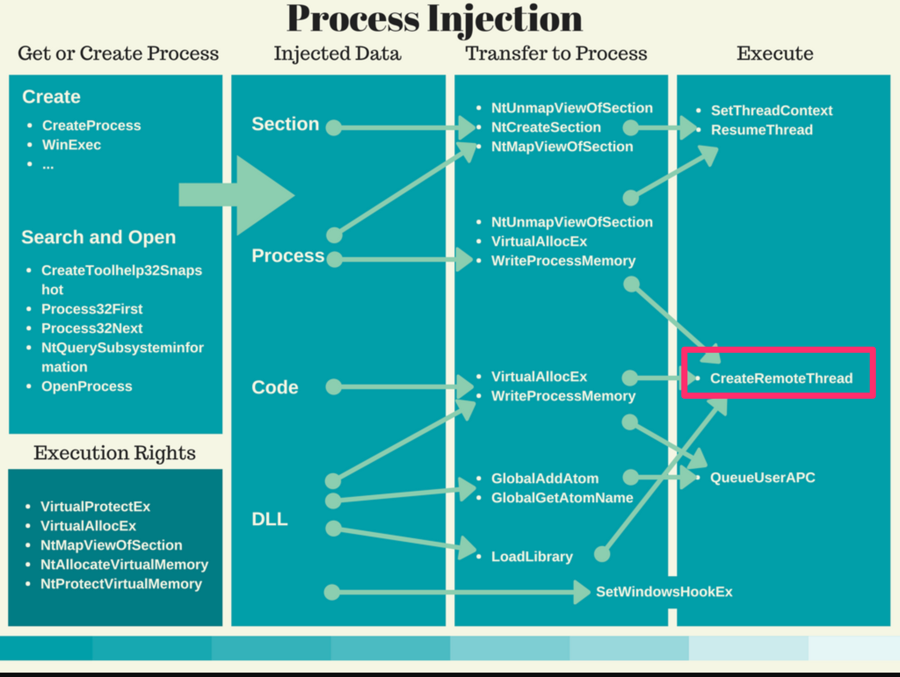
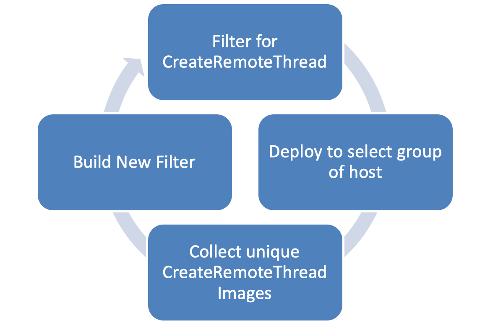

Create Remote Thread
====================

Sysmon will log **EventID 8** for all processes that use the Win32 API
[CreateRemoteThread](https://docs.microsoft.com/en-us/windows/win32/api/processthreadsapi/nf-processthreadsapi-createremotethread)
call.

This call is used by some programs, parts of the OS and debuggers making
the number of events easy to filter out the normal usages to detect the
outliers.

Process of use/abuse of CreateRemoteThread

* Use **OpenProcess( )** to open a target process.

* Use **VirtualAllocEx( )** allocate a chunk of memory in the process.

* Use **WriteProcessMemory( )** write the payload to the newly
    allocated section.

* User **CreateRemoteThread( )** to create a new thread in the remote
    process to execute the shellcode.

There are multiple Process Injection techniques, Sysmon monitors for the
most common one used. The infographic from
<http://struppigel.blogspot.com/2017/07/process-injection-info-graphic.html>

Illustrates the different techniques.



The fields for the event are:

* **RuleName**: Name of rule that triggered the event.

* **UtcTime**: Time in UTC when event was created

* **SourceProcessGuid**: Process Guid of the source process that
    created a thread in another process

* **SourceProcessId**: Process ID used by the OS to identify the
    source process that created a thread in another process

* **SourceImage**: File path of the source process that created a
    thread in another process

* **TargetProcessGuid**: Process Guid of the target process

* **TargetProcessId**: Process ID used by the OS to identify the
    target process

* **TargetImage**: File path of the target process

* **NewThreadId**: Id of the new thread created in the target process

* **StartAddress**: New thread start address

* **StartModule**: Start module determined from thread start address
    mapping to PEB loaded module list

* **StartFunction**: Start function is reported if exact match to
    function in image export tables

Since the number of processes that use the CreateRemoteThread( ) API in
a production environment is a low one the best approach is to exclude
known good processes by their full path. CreateRemoteThread( ) is not
the only API call that can be used to create a thread so it should not
be relied as a definitive guarantee of lack of process injection.



Example where known processes that use the API call are excluded

```xml
<Sysmon schemaversion="4.22">
    <CheckRevocation/>
    <EventFiltering>
        <RuleGroup name="" groupRelation="or">
            <CreateRemoteThread onmatch="exclude">
            <!--The process activity of those in the list should be monitored since an-->
            <!--attacker may host his actions in one of these to bypass detection.-->
            <TargetImage condition="end with">Google\Chrome\Application\chrome.exe</TargetImage>
            <SourceImage condition="is">C:\Windows\System32\wbem\WmiPrvSE.exe</SourceImage>
            <SourceImage condition="is">C:\Windows\System32\svchost.exe</SourceImage>
            <SourceImage condition="is">C:\Windows\System32\wininit.exe</SourceImage>
            <SourceImage condition="is">C:\Windows\System32\csrss.exe</SourceImage>
            <SourceImage condition="is">C:\Windows\System32\services.exe</SourceImage>
            <SourceImage condition="is">C:\Windows\System32\winlogon.exe</SourceImage>
            <SourceImage condition="is">C:\Windows\System32\audiodg.exe</SourceImage>
            <StartModule condition="is">C:\windows\system32\kernel32.dll</StartModule>
        </CreateRemoteThread>
        </RuleGroup>
    </EventFiltering>
</Sysmon>
```
