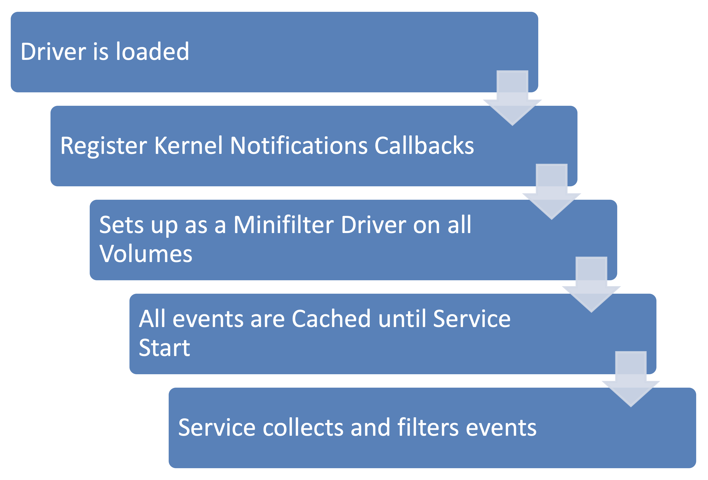
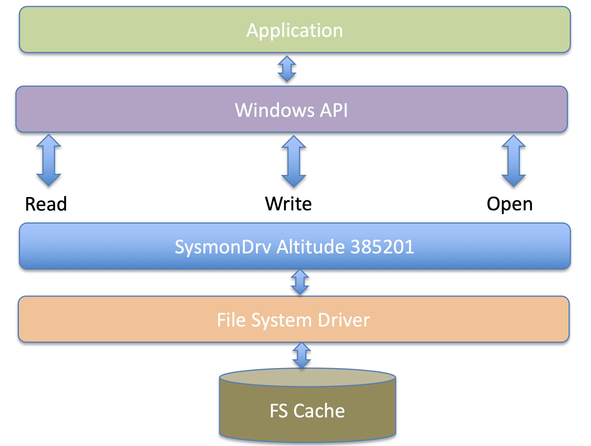
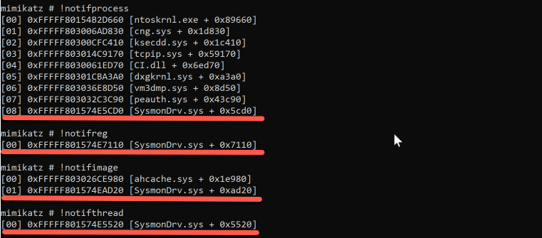

The Sysmon Driver
=================

All of the monitoring is performed thanks to a driver that Sysmon
installs called SysmonDrv. The driver will hook into Windows APIs and
leverage Event Tracing for Windows to capture the information on the
actions it wants to monitor.

This Sysmon Driver has a unique attitude number of 385201 that
determines the order of loading of the driver in comparison to other
drivers on the system. Some blog posts recommend changing this number
in the registry for obfuscation, but this may cause a conflict with
another driver and prevent Sysmon from working or causing other errors
on the system.

The driver is loaded by a service at system startup and a secondary
service then queries the cached information.

For all file system operations, the driver registers as a Minifilter
driver that is attached to volumes allowing it to see all actions as
APIs call for actions before they are processed by the file system.

In addition to this Sysmon sets multiple callbacks on kernel objects
in addition to using telemetry APIs and ETW in Windows.

When the tool is downloaded from the Microsoft Sysinternals website
<https://docs.microsoft.com/en-us/sysinternals/> it is important to save
and identify previous versions since Microsoft does not provide older
versions and the release notes are not detailed in terms what is fixed
in newer version. Microsoft has a fast release cycle forcing users to
test very carefully and to keep track of versions.

Another important piece of information is that there is no support from
Microsoft on the Sysinternal tools, they are free and provided as is.
This means that a testing plan for the environment it is deployed on
should be formulated, tested, implemented and improved upon as new
versions of Sysmon are released.
